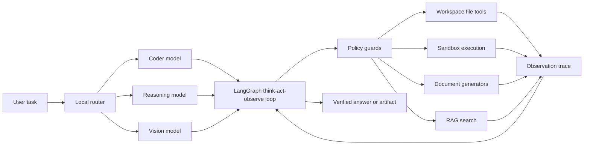

# Sovereign AI Workbench

> **A fully offline, tool-using AI agent for engineering work, document intelligence, and verified deliverables.**

Sovereign AI Workbench turns a natural-language request into an observable, multi-step execution. It classifies the task, chooses the right local model, calls safe project tools, verifies code changes, and returns a useful answer or a downloadable artifact.

No prompt, source file, image, or generated report needs to leave the machine.

## Why this can win a hackathon

Most agent demos stop at text generation. This one is built around the moment after generation: **doing the work and proving it worked**.

- **Private by design:** Ollama serves every model locally through LiteLLM; there are no hosted AI calls in the runtime.
- **One interface, multiple expert modes:** coding, reasoning, document creation, OCR, image analysis, and semantic search.
- **Real outputs:** generate Word reports, PDFs, Excel workbooks, PowerPoint decks, and tested code instead of returning prose only.
- **Evidence before confidence:** coding tasks are blocked from finalizing until the latest change has a successful `exit_code=0` verification.
- **Inspectable execution:** every step prints the model’s thought, selected action, tool input, and observation.
- **Operationally conscious:** model unloading helps smaller GPUs, while path confinement prevents tools from escaping the project folder.

## The 30-second demo

### 1. Start the local model stack

Install [Ollama](https://ollama.com/) and pull the models used by the included router:

```powershell
ollama serve
ollama pull qwen2.5:7b
ollama pull qwen2.5-coder:7b
ollama pull granite3.2-vision
ollama pull minicpm-v
ollama pull nomic-embed-text
```

Start the LiteLLM proxy in a second terminal from the repository root:

```powershell
litellm --config litellm_config.yaml --port 4000
```

### 2. Install Python dependencies

```powershell
python -m venv .venv
.\.venv\Scripts\Activate.ps1
python -m pip install -r requirements.txt
python -m pip install openai langgraph numpy pymupdf python-docx openpyxl paddleocr
```

### 3. Ask the agent to make something

```powershell
python run_agent.py "Create sandbox/hello.py with a function that reverses a string, run it, and report the result"
```

Try the artifact path:

```powershell
python run_agent.py "Create a concise PDF report explaining the value of local AI for refinery maintenance teams"
```

Generated deliverables are written to `outputs/`; agent-created code is written to `sandbox/`.

## What it can do

| Workflow | Example request | Result |
| --- | --- | --- |
| Coding | “Write and test a Python CSV validator” | Code in `sandbox/`, followed by an execution check |
| Reasoning | “Summarize this maintenance log” | Grounded answer or a generated report |
| Documents | “Create a Word approval note from this report” | `.docx` in `outputs/` |
| Data | “Build an Excel tracker from these rows” | Formatted `.xlsx` in `outputs/` |
| Presentations | “Make a five-slide safety briefing” | `.pptx` in `outputs/` |
| Vision | “Read this scanned inspection image” | Local OCR and/or vision analysis |
| RAG | “What does the ingested SOP say about pressure limits?” | Semantically retrieved passages with source names |

Attach an image to a request with:

```powershell
python run_agent.py "Read the attached inspection image and list the visible findings" --image sandbox/images.jpg
```

## How the runtime works



The agent is assembled as a LangGraph state machine:

1. **Classify** the request as coding, vision, or reasoning.
2. **Route** it to a local worker model.
3. **Act** through a strict JSON tool contract.
4. **Observe** the tool result and continue until the task is complete.
5. **Verify** code after the latest write or edit.
6. **Finish** with a final answer and any files created under the approved output folders.

## Built-in tools

- Workspace navigation and text file read/write/edit
- Python and shell command execution with timeouts
- PDF, DOCX, XLSX, and PPTX text extraction
- OCR and local multimodal image analysis
- DOCX, PDF, XLSX, and PPTX generation
- Semantic document search backed by local embeddings and a plain JSON vector store

## Grounding your own reference set

The RAG store uses `nomic-embed-text`, NumPy cosine similarity, and no external vector database. Ingest local text documents, then search them:

```powershell
python -m workbench.rag ingest .\path\to\sop.txt .\path\to\maintenance_notes.txt
python -m workbench.rag search "What is the inspection interval?"
```

The agent can call the same capability through `search_docs` when a request involves plant procedures, limits, standards, or equipment specifications.

## Safety and trust model

This is an offline engineering assistant, not an autonomous approval authority.

- All resolved paths must remain inside the repository root.
- Generated reports are explicitly marked as drafts requiring human engineer sign-off.
- Code changes must be followed by a successful local run before the agent can honestly finalize.
- Sandbox and command execution have a 60-second timeout.
- The orchestrator detects malformed model JSON, repeated actions, blank responses, and runaway step counts.
- `outputs/` and `sandbox/` make artifacts and generated code easy to inspect, test, and delete.

## Project map

```text
run_agent.py             CLI entry point
litellm_config.yaml      Local Ollama model aliases
workbench/agent.py       LangGraph orchestration and policy guards
workbench/tools.py       File, execution, vision, and artifact tools
workbench/llm.py         OpenAI-compatible local proxy client
workbench/rag.py         Local ingestion and semantic retrieval
workbench/config.py      Paths, model names, timeouts, and limits
workbench/data/          JSON vector store
outputs/                 Generated reports and office files
sandbox/                 Agent-created code and execution scratch space
```

## Configuration

The defaults target a local LiteLLM proxy at `http://localhost:4000`, backed by Ollama at `http://localhost:11434`. Adjust model aliases, timeouts, and the step budget in `workbench/config.py`; adjust provider mappings in `litellm_config.yaml`.

The included defaults are intentionally modest enough for a mid-range GPU. The router and reasoning worker share `qwen2.5:7b`, which reduces model swapping, while `qwen2.5-coder:7b` handles code and Granite/MiniCPM handle visual work.

## Current limitations

- Local model quality and latency depend on available RAM/VRAM.
- Scanned PDFs need OCR rather than selectable-text extraction.
- The vector store is a lightweight JSON file, suitable for a hackathon-scale reference set rather than millions of chunks.
- Human review remains required for engineering decisions and generated approvals.

## License

No license file is currently included. Add the project’s intended license before public distribution.